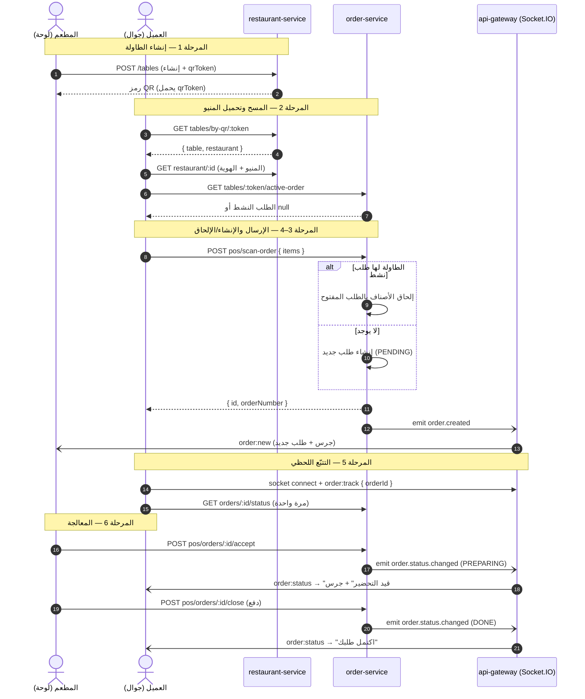

<div dir="rtl">

# سير عمل طلب الطاولة عبر QR — خطوة بخطوة

كيف يطلب العميل من الطاولة بمسح رمز QR، وكيف يصل الطلب إلى المطعم. يغطّي
الطرفين: **الطاولة/المطعم** و**العميل**.

---

## الأطراف والمنافذ

| الجزء | التطبيق | المنفذ | الدور |
|------|---------|--------|------|
| صفحة العميل | `client` (Next.js) | 3010 | منيو QR + الطلب + التتبّع اللحظي |
| لوحة التحكم | `dashboard` (Next.js) | — | نقطة البيع، الطاولات، الطلبات |
| البوابة | `api-gateway` | 3000 | Socket.IO (اللحظي) |
| خدمة الطلبات | `order-service` | 3001 | طلبات POS / QR |
| خدمة المطعم | `restaurant-service` | 3003 | الطاولات والمنيو |

طلبات HTTP للعميل تمرّ **نفس الأصل** عبر تمريرات Next.js
(`/api/order/*`، `/api/restaurant/*`). أما اللحظي فاتصال **مباشر** بـ Socket.IO
على البوابة `<host>:3000`.

---

## المرحلة 1 — المطعم: إنشاء الطاولة (مرة واحدة)

1. اللوحة ← **الطاولات** (`/tables`) ← أضف طاولة (رقم، سعة، قسم).
   - `POST /api/restaurant/tables`
2. يخزّن الخادم الطاولة برمز **`qrToken`** فريد غير قابل للتخمين.
3. تُولّد اللوحة رمز QR يحمل رابط العميل:

   ```
   {CLIENT_URL}/{restaurant-slug}/t/{qrToken}
   ```

4. اطبع الرمز وضعه على الطاولة. (يمكن تجديده في أي وقت عبر
   `POST /api/restaurant/tables/:id/regenerate-qr` — تتوقف الرموز القديمة.)

> الناتج: رمز QR ثابت لكل طاولة يحمل `qrToken` غير قابل للتخمين.

---

## المرحلة 2 — العميل: المسح وتحميل المنيو

1. يمسح العميل الرمز ← تُفتح صفحة `client` على المسار `[restaurant]/t/[token]`.
2. تستخرج الصفحة الطاولة من الرمز:
   - `GET /api/restaurant/public/tables/by-qr/:token` ← `{ table, restaurant }`
   - رمز غير صالح/معطّل ← "رمز الطاولة غير صالح".
3. تحمّل المنيو العام + الهوية (الشعار، الغلاف، اللون الرئيسي):
   - `GET /api/restaurant/:restaurantId`
4. تتحقق إن كان للطاولة طلب مفتوح:
   - `GET /api/order/public/tables/:token/active-order` ← الطلب النشط أو `null`

**التفرّع:**
- **لا يوجد طلب نشط** ← عرض المنيو (طلب جديد).
- **يوجد طلب نشط** ← الهبوط على **شاشة التتبّع** (المرحلة 5). يمكن للعميل الضغط
  على "العودة للمنيو" للتصفّح والإضافة.

> العميل يمسح الرمز فيُحمَّل المنيو، ويُكتشف إن كان للطاولة طلب مفتوح.

---

## المرحلة 3 — العميل: بناء السلة والإرسال

1. تصفّح المنيو ← اضغط صنفاً ← اختر الكمية ← "أضف للطلب".
2. شاشة السلة: يستطيع العميل **الإضافة أو الحذف للأصناف التي لم تُرسل بعد فقط**.
3. الإرسال:
   - `POST /api/order/pos/scan-order`
   - الجسم: `{ qrToken, customerName?, customerPhone?, items: [{ mealId, mealName, basePrice, quantity }] }`
   - الرد: `{ id, orderNumber }`

يُحفظ معرّف الطلب في `localStorage` (المفتاح `sufra:scan-order:<token>`) ليُستأنف
التتبّع عند إغلاق/تحديث الصفحة.

> العميل يبني السلة ويرسلها؛ الحذف متاح قبل الإرسال فقط.

---

## المرحلة 4 — الخادم: إنشاء أو إلحاق

عند `scan-order` يفحص الخادم الطاولة بحثاً عن فاتورة نشطة
(`PENDING` / `OPEN` / `PREPARING`):

- **لا يوجد** ← إنشاء طلب **جديد** بحالة `PENDING` (بانتظار قبول الطاقم).
- **يوجد نشط** ← **إلحاق** الأصناف الجديدة بذلك الطلب (إعادة حساب الإجمالي).
  الأصناف المُرسلة تبقى على الفاتورة — العميل يضيف فقط.

في كل الحالات يبثّ الخادم `order.created` عبر NATS ← تدفع البوابة `order:new`
لغرفة المطعم ← **جرس اللوحة + ظهور الطلب الجديد**.

> الخادم يُنشئ طلباً جديداً (PENDING) أو يُلحِق الأصناف بالطلب المفتوح ثم يُنبّه اللوحة.

---

## المرحلة 5 — العميل: التتبّع اللحظي (WebSocket)

1. تفتح الصفحة اتصال Socket.IO **كضيف** بالبوابة:
   - `io("<host>:3000", { transports: ["polling","websocket"] })`
2. عند الاتصال تشترك بغرفة طلبها:
   - تبثّ `order:track` `{ orderId }`
3. تُجلب الحالة الابتدائية **مرة واحدة** (`GET /api/order/public/orders/:id/status`)؛
   بعدها تصل التحديثات **فقط** عبر حدث `order:status`.
4. عند كل تغيّر حالة ← يرنّ جرس + تظهر لافتة بالحالة الجديدة.

الحالات التي يراها العميل:

| localStatus | تسمية العميل | الخطوة |
|-------------|--------------|--------|
| `pending`   | بانتظار تأكيد المطعم | 0 |
| `preparing` | قيد التحضير | 1 |
| `done`      | اكتمل طلبك | 2 |
| `voided`    | أُلغي الطلب | — |

> التتبّع لحظي عبر WebSocket — بلا polling. أول حالة تُجلب مرة واحدة والباقي بثّ مباشر.

---

## المرحلة 6 — المطعم: معالجة الطلب (POS / الطلبات)

يرى الكاشير الفاتورة في **نقطة البيع** (`/pos`) أو **الطلبات** (`/orders`):

| الإجراء | النقطة | الحالة الجديدة | يرى العميل |
|---------|--------|----------------|------------|
| قبول | `POST /api/order/pos/orders/:id/accept` | `PREPARING` | قيد التحضير |
| رفض | `POST /api/order/pos/orders/:id/reject` | `VOIDED` | أُلغي الطلب |
| إقفال (دفع) | `POST /api/order/pos/orders/:id/close` | `DONE` | اكتمل طلبك |
| إنهاء | `POST /api/order/pos/orders/:id/finish` | `DONE` | اكتمل طلبك |

كل انتقال يبثّ `order.status.changed` عبر NATS ← تدفع البوابة `order:status`
لغرفة الطلب ← يتحدّث متتبّع العميل فوراً.

في POS يمكن للكاشير اختيار الطاولة من **منتقي الطاولات البصري** (أخضر = مشغولة،
أصفر = بانتظار، أبيض = متاحة)؛ والضغط على طاولة مشغولة يفتح فاتورتها.

> الكاشير يقبل/يرفض/يُقفل الفاتورة؛ كل تغيير يصل العميل فوراً.

---

## المخطّط التسلسلي (Mermaid)



---

## قواعد الاستئناف والاستمرارية

- يُحفظ مؤشّر الطلب في `localStorage` لكل رمز طاولة ← التحديث/الإغلاق يعيد الهبوط
  على المتتبّع.
- **جهاز جديد** بلا طلب محفوظ يهبط أيضاً على المتتبّع إن كان للطاولة فاتورة مفتوحة
  (تُقرأ من `active-order`).
- "العودة للمنيو" تترك المتتبّع ليضيف العميل المزيد (دون قذفه تلقائياً للتتبّع)؛
  وتظهر في المنيو لافتة بزر "تتبّع الطلب" للرجوع.
- عند صيرورة الفاتورة `DONE`/`VOIDED` لا يبقى للطاولة طلب نشط ← المسح التالي يبدأ من جديد.

---

## الملفات الرئيسية

| الموضوع | الملف |
|---------|------|
| صفحة العميل | `client/src/app/[restaurant]/t/[token]/page.tsx` |
| طلب المسح + الإلحاق + الحالة العامة | `servers/apps/order-service/src/pos/pos.service.ts` |
| المسارات العامة | `servers/apps/order-service/src/order-service.controller.ts` |
| استخراج الطاولة بالـ QR / المنيو | `servers/apps/restaurant-service/src/restaurant-service.*` |
| بوابة السوكِت (ضيف + `order:track`) | `servers/apps/api-gateway/src/gateway/socket.gateway.ts` |
| جسر اللحظي (NATS → سوكِت) | `servers/apps/api-gateway/src/api-gateway.controller.ts` |
| واجهات POS / الطاولات / الطلبات | `dashboard/src/app/(dashboard)/{pos,tables,orders}/page.tsx` |

</div>
